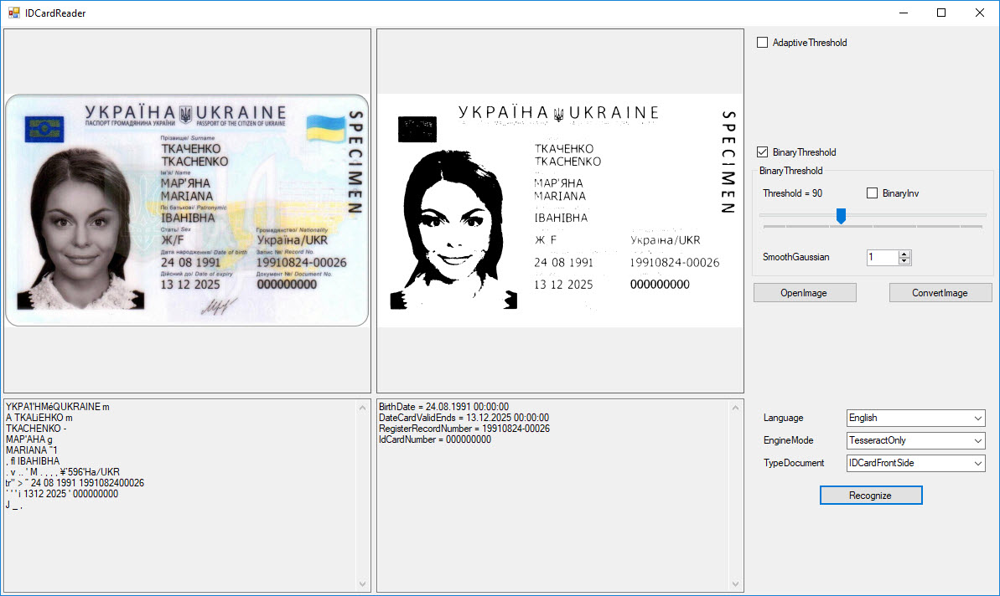
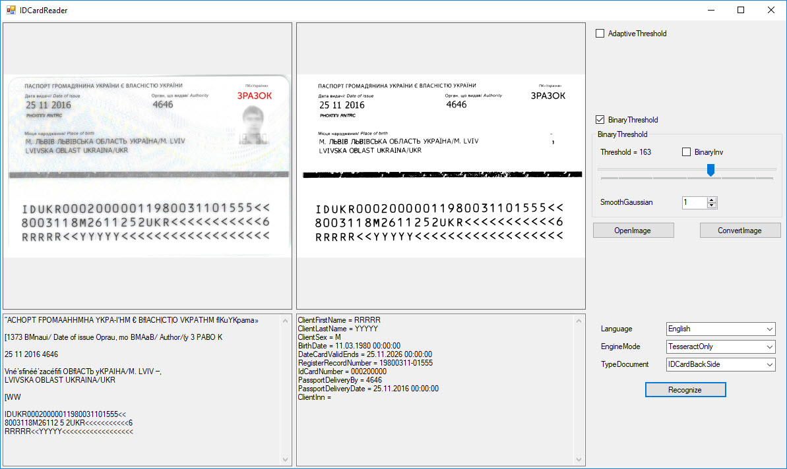
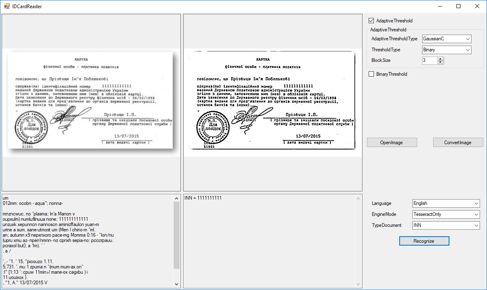
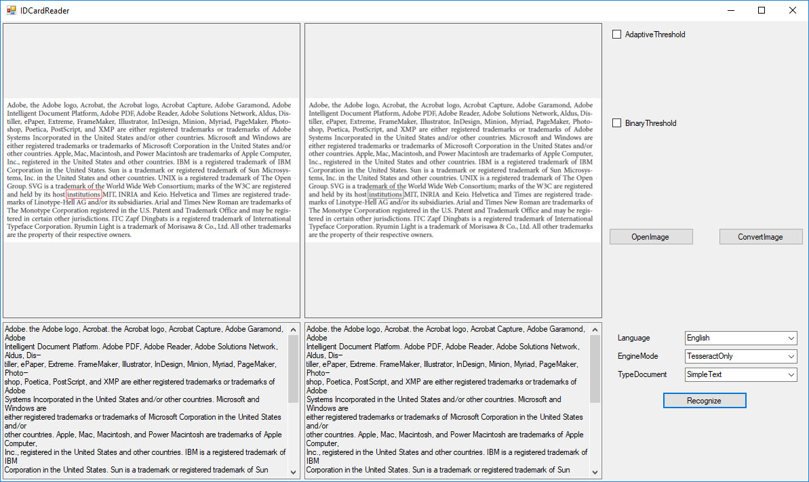

# idcard_detection_emgucv_example
Simple WindowsForms project that shows how to ocr text from images using EmguCv. Also you can recognize MRZ data from IdCard(Ukraine), I have written my own simple parser.

### Example IdCardFrontSide

### Example IdCardBackSide

### Example Inn

### Example SimpleText

